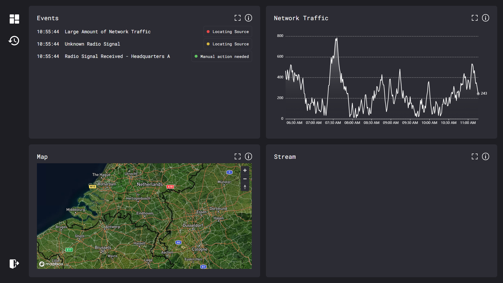
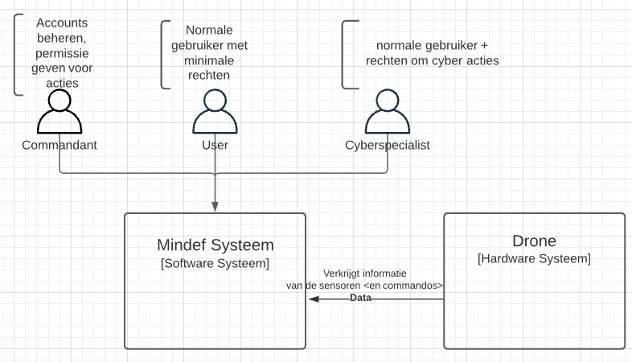
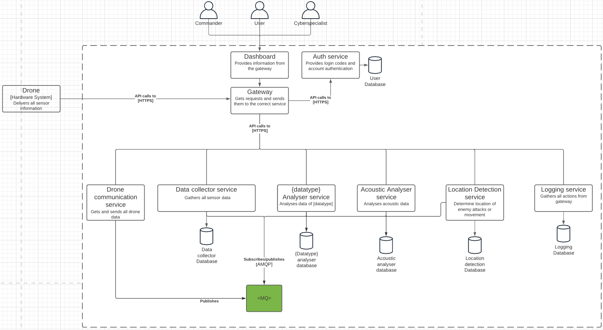
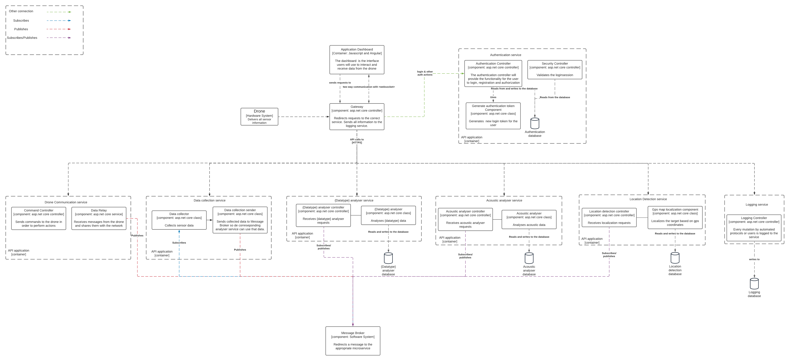

# MinDef Cyber Dashboard
Welcome to the MinDef GitHub repository!
This project is an initiative in collaboration between the Fontys University of Applied Sciences and the Ministery of Defence outpost in Oirschot.

The goal of the project is to innovate and experiment to make optimal use of the data collected by autonomous tanks (drones).
## Table of Contents
- [Participators & Stakeholders](#participators--stakeholders)
- [Build Status](#build-status)
- [Getting Started](#getting-started-kubernetes)
- [Services](#services)
- [Architecture](#application-architecture)
- [Research](#research)
- [Hosting](#hosting)

# Participators & Stakeholders
|Name|Email|Role/Spec|From|
|---|---|---|---|
|**Jean Piere**|*contact a team member*|Stakeholder, PO|1-21 till now|
|**Jeffrey Cornelissen**|j.cornelissen fontys.nl|SE Teacher|1-21 till 7-21|
|**Erik van der Schriek**|e.vanderschiek fontys.nl|SE Teacher|1-21 till 7-21|
|**Gerard Elbers**|g.elbers fontys.nl|SE Teacher|1-21 till 7-21|
|*Team active from:*|*01-2021 t/m 07-2021*|-----------------|-------------|
|**Luuk Ebenau**|l.ebenau student.fontys.nl|SE member|1-21 till 7-21|
|**Youri Saman**|y.saman student.fontys.nl|SE-CS member|1-21 till 7-21|
|**Twan Beeren**|t.beeren student.fontys.nl|SE member|1-21 till 7-21|
|**Roel Lucassen**|r.lucassen student.fontys.nl|SE-CS member|1-21 till 7-21|
|**Ruben Hemmes**|r.hemmes student.fontys.nl|SE-CS member|1-21 till 7-21|
|**Alexander Lambooij**|a.lambooij student.fontys.nl|SE-CS member|1-21 till 7-21|

# Build Status
|Service|Status|
|---|---|
|AuthService|[](https://github.com/fhict-mindef-s66/MinDef-AuthService/actions/workflows/dotnet.yml)|

# Getting started (Kubernetes)

- find a place with kubernetes installed to host the application
- ```sudo microk8s enable ingress dns metrics-server storage```

### cookie for rabbitmq services communication
- ```echo -n "some secret key" > cookie```
- ```sudo microk8s kubectl create secret generic erlang-cookie --from-file=./cookie```
#### install rabbitmq on the cluster:
- ```sudo microk8s kubectl apply -f "https://github.com/rabbitmq/cluster-operator/releases/latest/download/cluster-operator.yml"```
### for admin user
- ```echo -n "mindef" > user```
- ```echo -n "kldjlkh5ihfikjfn4" > pass```
- ```sudo microk8s kubectl create secret generic rabbitmq-admin --from-file=./user --from-file=./pass```
- ```rm pass```
- ```rm user```

### and now pull the repo
- ```git pull <this repository url"```
- ```cd MinDef/kubernetes```
- optionally edit the hostnames of the ingress to something appropiate 

and then
- ```sudo microk8s kubectl apply -f .```
- ```sudo microk8s kubectl config set-context --current --namespace=mindef```
- ```sudo microk8s kubectl apply -f ./frontend```
- etc. repeat for each folder

and thats it! your application should be up and running.

since the ingress makes use of host mapping, you should configure your OS's hostsfile to redirect the right (sub)domains to your application. 
in my case i've added:
```cs
# Mindef Hostname mapping
192.168.220.45 mindefdashboard.nl
192.168.220.45 api.mindefdashboard.nl
## development only
192.168.220.45 authservice.mindefdashboard.nl
```
you probably need to restart your device for these changes to take into effect.

and thats it! your application should be up and running.

# Services
For all the services, there's an Postman workspace which contains all the requests.
[https://app.getpostman.com/join-team?invite_code=ee304ee64afcbcde3ecfc8066f19272e&ws=4ce06c57-080a-4536-8acb-24e234a51ccc](https://app.getpostman.com/join-team?invite_code=ee304ee64afcbcde3ecfc8066f19272e&ws=4ce06c57-080a-4536-8acb-24e234a51ccc)
## Dashboard (frontend)
This is the application that will be used to overview all data and insights collected by the system.

## Api Gateway
This is the communication gateway between the dashboard and the services, it takes care of authentication and linking requests to the right service.
## Auth Service
This service is responsible for hnadling authentication, managing application users and generating tokens 
## Sensor Mock Service
This is a temporary service, designed to **mock** and **simulate** data normally retrieved by sensors and the drones. 
## Data Collector Service
The job of the data collector service is to listen to the raw data streams in the system, and combine those data streams into more specific streams
## Network Data Analyser Service(s)
The data analyser service(s) Are services that gather information and insights from the raw data streams in the system. The data flow generally goes as following:
- mock service [raw data] -> data collector service -> data analyser -> information/insights
## Notification Service
The goal of this service is to send notifications to the frontend to:
-  specific users
-  groups(e.g. commanders)

# Application architecture
We designed the application using the C4 Model, as following you can find the C1 t/m c4 diagrams of the application.

the application is designed using LucidChart, located at [https://lucid.app/lucidchart/0f102e07-5322-4b9c-a49c-877b9c1c58a4/edit](https://lucid.app/lucidchart/0f102e07-5322-4b9c-a49c-877b9c1c58a4/edit?shared=true&page=Hvrh6oVuJI0e#)
## C1

## C2

## C3


# Research
During the development we've researched various subjects. Thee are partly dutch and partly english
|Subject|Link|
|---|---|
|**Authentication**|[research/research_auth.docx](./docs/research/research_auth.docx)|
|**External Communication**|[research/external_communication.docx](./docs/research/external_communication.docx)|
|**Installation&extensibility**|[research/install_and_extensibility.docx](./docs/research/instal_and_extensibility.docx)|
|**UX Research**|[research/ux_research.docx](./docs/research/ux_research.docx)|
|**Research on potential defensive and offensive actions**|[research/actions_research.docx](./docs/research/actions_research.docx)|
|**MQ Architecture**|[research/mq_research.docx](./docs/research/mq_research.docx)|
|**Overview of Sensors on the drone**|[research/sensor_research.docx](./docs/research/sensor_research.docx)|
|**Testplan**|[research/testplan.docx](./docs/research/testplan.docx)|

# Hosting
we are currently hosting the application on the NetLab server owned by FHICT. To access this server you will need a fontys vpn (cisco).
once connected to the vpn you can access the application on [192.168.220.45](192.168.220.45)
and can manage the server at: [https://vcenter.fhict.local/ui/app/vm;nav=h/urn:vmomi:VirtualMachine:vm-23476613:705BE42C-681E-44C4-994F-D3D8B75D4D6A/summary](https://vcenter.fhict.local/ui/app/vm;nav=h/urn:vmomi:VirtualMachine:vm-23476613:705BE42C-681E-44C4-994F-D3D8B75D4D6A/summary)

connect using ssh using the credentials, which you can receive from a team member.